# Hangman

Hangman is a word-guessing game, that runs in a terminal. The objective of the game is to find the word by guessing letters.

The live version of the website can be found by clicking [here](https://pyth-hangman.herokuapp.com/).

##  __How to play__

This game is modelled on the classic paper and pencil game of the same name. After inputting their name and choosing the difficulty, players will be presented with a series of underscores, and told how many letters are in the word. They then have 10 lives, and must successfuly find all of the letters in the word before they run out.

##  __Features__

The game features a welcome message before the name input:

Upon entering a name, it presents the user wih a choice of difficulty:

Finally, the word is printed and its length is declared:

##  __Input validation__

### Username input

* The user must enter a valid username, which is composed uniquely of alphabetical characters:

* If this is the case, then a greeting is printed with the name:

* However, if the input is invalid, using a non-alphabetical character such as a number or a symbol, the following message is printed:

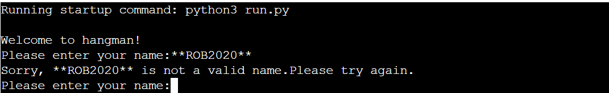

### Choose difficulty input

* When users have input their name successfully, they will then be faced with a choice of difficulties:

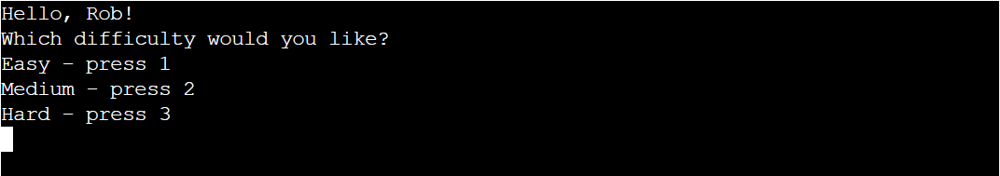

* If they do not input the correct character, either 1, 2, or 3, then the following happens:

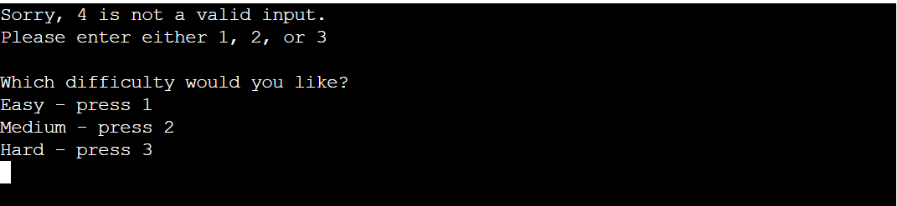

* If they enter the correct input, such as below...:

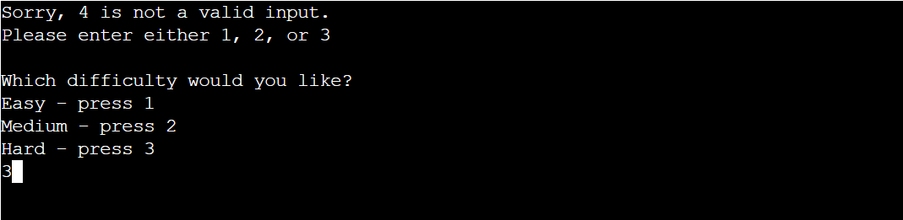

* They will then pass to the game stage, with confirmation of their chouce printed at the top of the terminal.

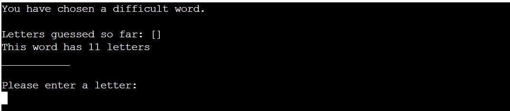

### Guess letter input

* If a user enters a letter, and that letter has not already been guessed, and the letter appears in the word, then they receive the following messages:

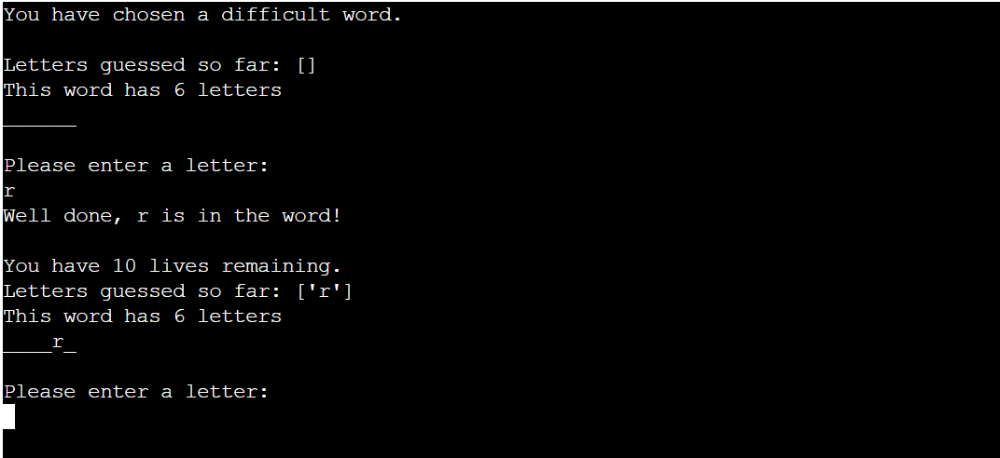

* If a user enters a letter that has already been guessed, they will see the following messages printed:

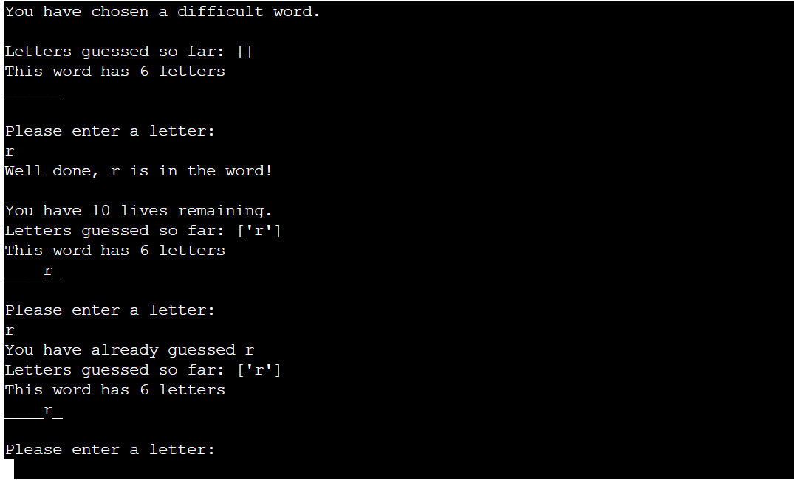

* If a user enters a letter, and this does not appear in the word, then they will see the following messages:

* If a user enters an invalid guess, i.e a number or a symbol, then they will receive the following message:

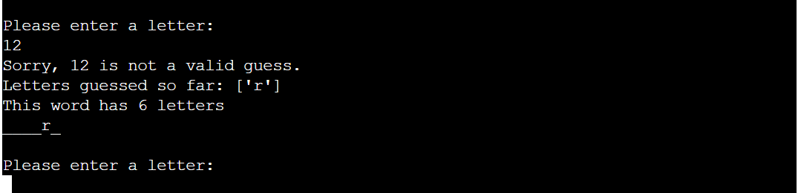

### End game input

* Upon finishing a game, either winning or losing, the user will have the choice as to whether or not to play again:

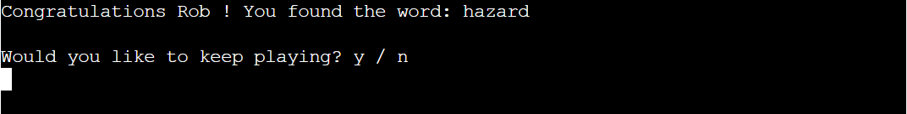

* If the user inputs y, as in the screenshot below:

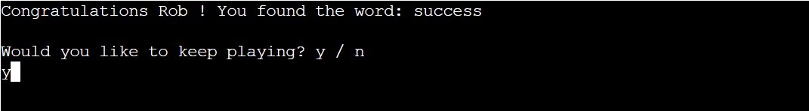

* They will be re-directed to the choose difficulty function, and can start a new game:

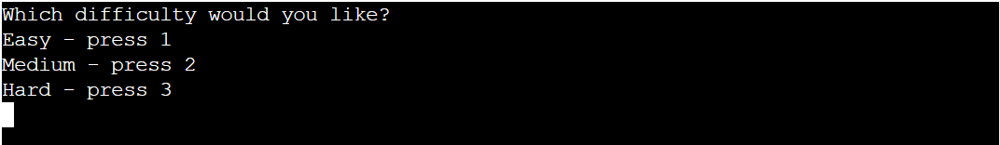

* If the user enters invalid input, they will see the following message:

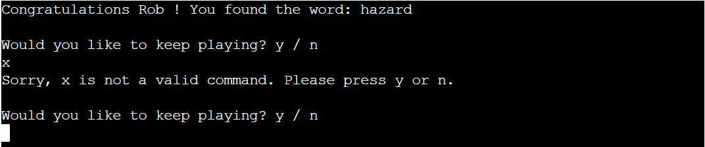

* If the user enters n, then the game ends and they will see this message:

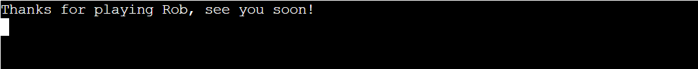

## __Flowchart__

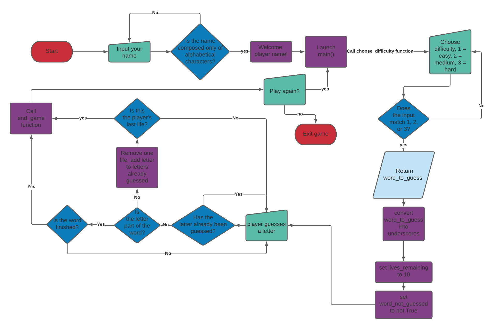

## __Testing__

## __Bugs__

## __Credits__

* When researching this project, I did a lot of research on the best way to structure the code, e.g, should everything be within one function or not, which features should come in which order. I found [this Youtube Video](https://www.youtube.com/watch?v=m4nEnsavl6w&ab_channel=Kite) which proved very helpful. A link to the github repository used for the code in the video can be found by clicking [here](https://github.com/kiteco/python-youtube-code/tree/master/build-hangman-in-python).
* I also used [this](https://inventwithpython.com/invent4thed/chapter8.html) website in order to gather ideas for the structure of the code.
* The most complicated part of the code for me to code was on lines 186-189 on run.py. By studying both [this](https://stackoverflow.com/questions/41747017/python-hangman-removing-blanks-from-the-answer-pool-and-refining-what-can-be-in) answer and [this](https://stackoverflow.com/questions/26937153/python-hangman-replacing-letters) one on stack overflow, I was able to understand exactly what problems I was having. 

##  __Deployment__

* This application has been deployed to Heroku. I will describe the process I used below:

* Log in to your Heroku account, and when you are on the dashboard, click on the new button in the top right-hand corner, and then click 'create new app'

* You must now choose a name for your app, which must be unique, and the appropriate region.

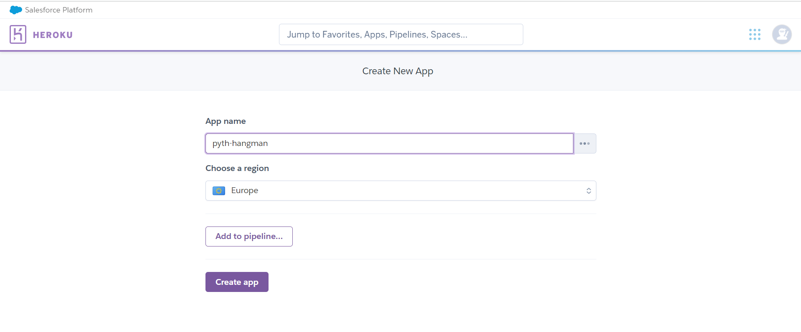

* On the next page, you will see the Github logo. As my repository is stored there, I connected it to my github account.

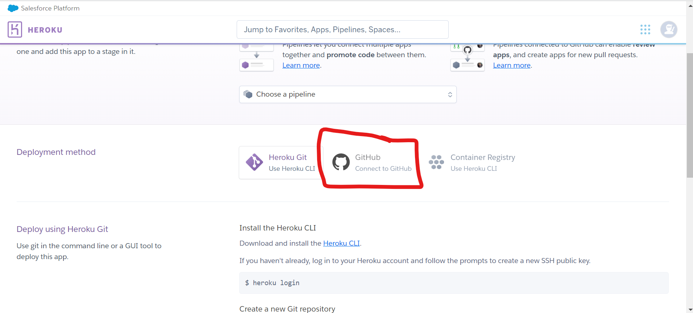

* You must then type in the name of your repository in order for it to be connected.

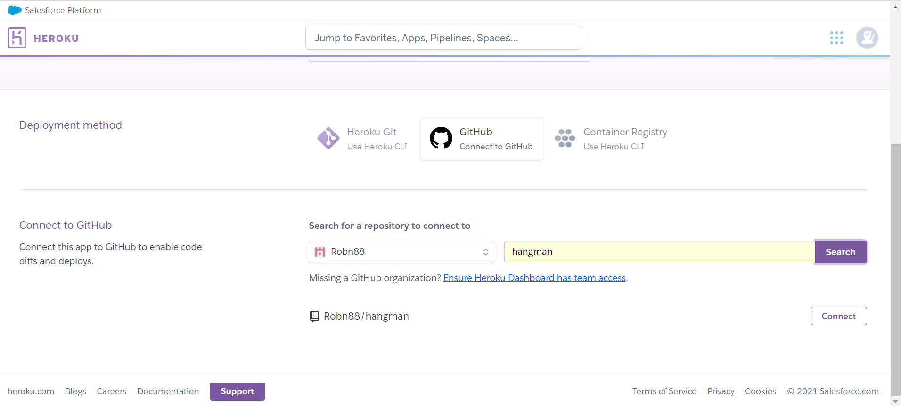

* Once that is done, click on the settings tab at the top.

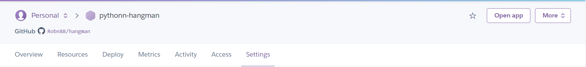

* Scroll down until you reach config vars, and click on the button, 'Reveal Config Vars'.

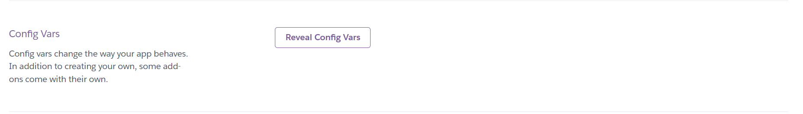

* In the key section, type 'PORT' (it MUST be in capital letters) and in the value section, 8000.

* Next, select buildpacks, and add python, and nodejs.

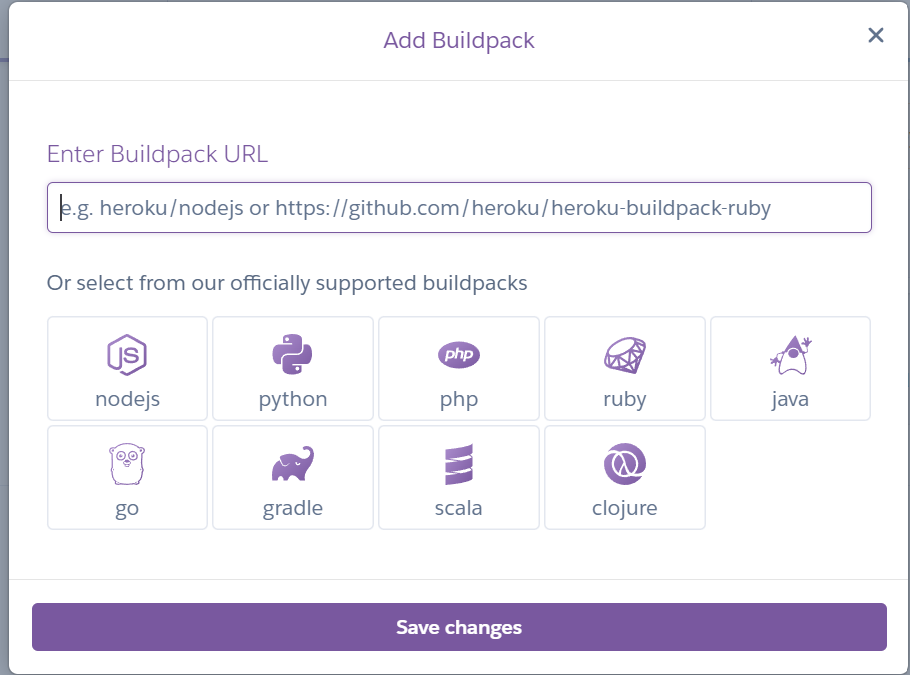

* When they have been successfully added, they should look as follows:

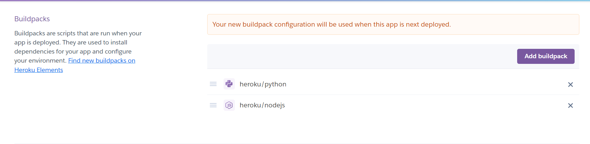

* Now, go back to the deploy tab, and scroll down until you see this button. Click 'Deploy Branch'.

* You should see the terminal working while it deploys, as below:

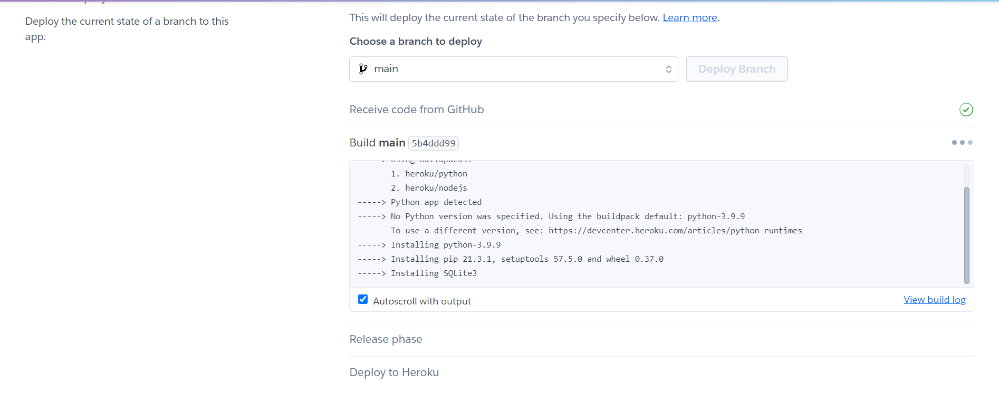

* If everything has been successful, then you should see the following message printed:

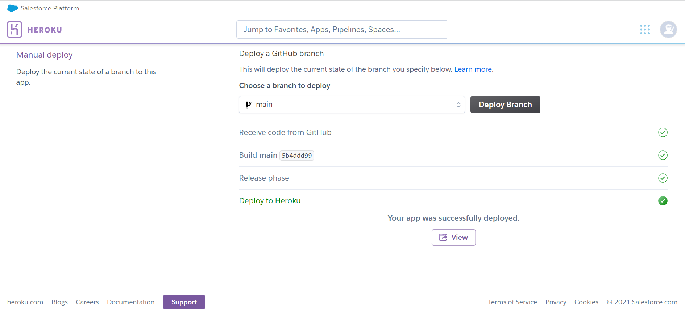

* By clicking 'View', you will be able to see the app running in a new tab, as below:

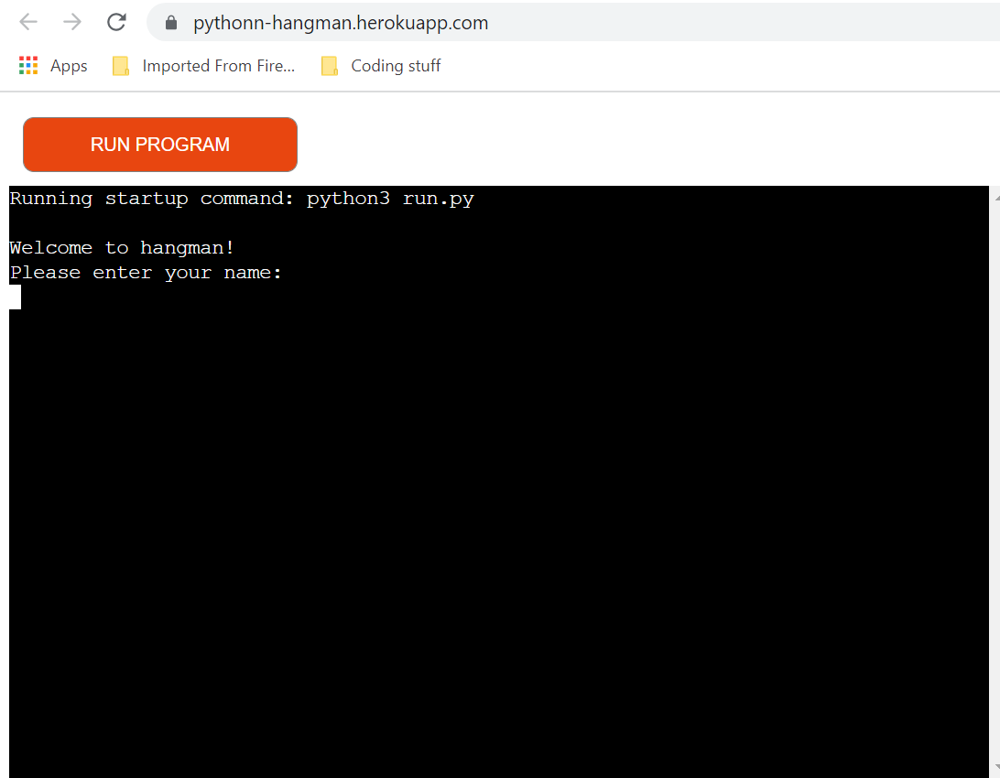

### Local Deployment

If you would like to make a clone of this repository, you can type the following command in your IDE terminal:

- `git clone https://github.com/Robn88/hangman`

Alternatively, if using Gitpod, you can click below to create your own workspace using this repository.

