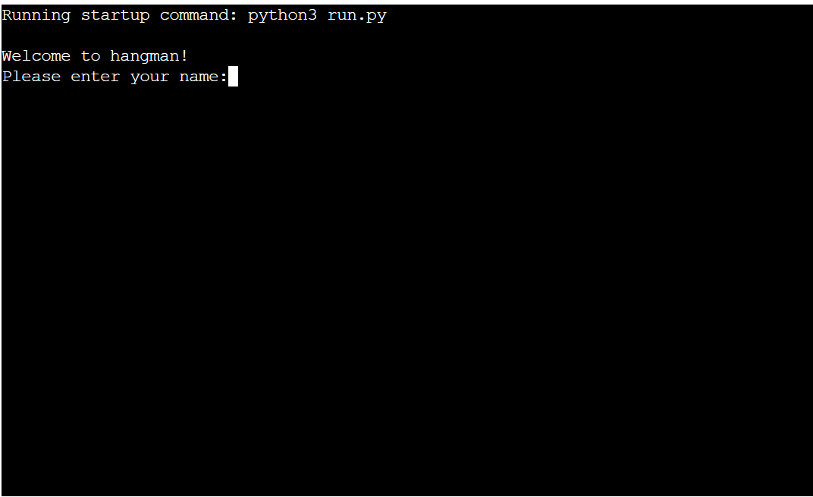
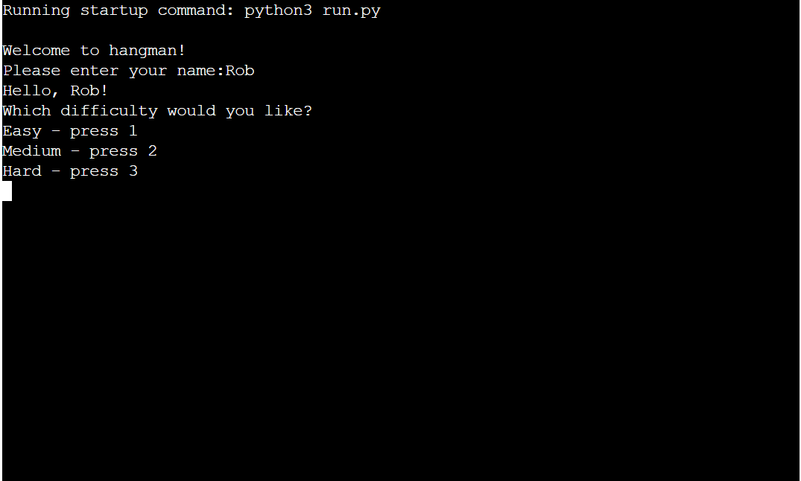
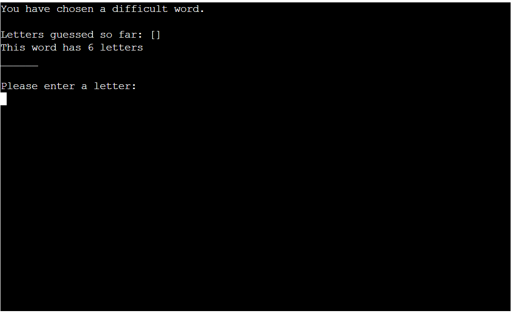
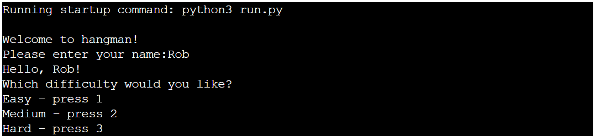

# Hangman

Hangman is a word-guessing game, that runs in a terminal. The objective of the game is to find the word by guessing letters.

The live version of the website can be found by clicking [here](https://pyth-hangman.herokuapp.com/).

##  __How to play__

This game is modelled on the classic paper and pencil game of the same name. After inputting their name and choosing the difficulty, players will be presented with a series of underscores, and told how many letters are in the word. They then have 10 lives, and must successfuly find all of the letters in the word before they run out.

##  __Features__

The game features a welcome message before the name input:

Upon entering a name, it presents the user wih a choice of difficulty:

Finally, the word is printed and its length is declared:

##  __Input validation__

### Username input validation

* The user must enter a valid username, which is composed uniquely of alphabetical characters:

* If this is the case, then a greeting is printed with the name:

