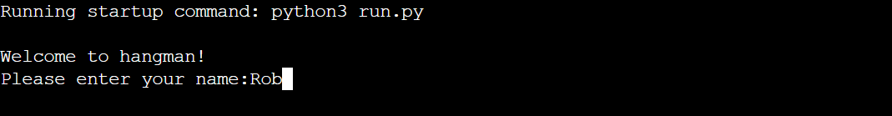
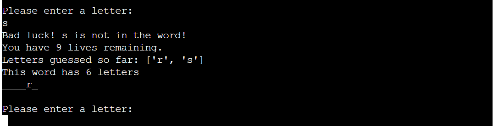

# Hangman

Hangman is a word-guessing game, that runs in a terminal. The objective of the game is to find the word by guessing letters.

The live version of the website can be found by clicking [here](https://pyth-hangman.herokuapp.com/).

##  __How to play__

This game is modelled on the classic paper and pencil game of the same name. After inputting their name and choosing the difficulty, players will be presented with a series of underscores, and told how many letters are in the word. They then have 10 lives, and must successfuly find all of the letters in the word before they run out.

##  __Features__

The game features a welcome message before the name input:

Upon entering a name, it presents the user wih a choice of difficulty:

Finally, the word is printed and its length is declared:

##  __Input validation__

### Username input

* The user must enter a valid username, which is composed uniquely of alphabetical characters:

* If this is the case, then a greeting is printed with the name:

* However, if the input is invalid, using a non-alphabetical character such as a number or a symbol, the following message is printed:

### Choose difficulty input

* TO BE DONE WHEN BUG FIXED

### Guess letter input

* If a user enters a letter, and that letter has not already been guessed, and the letter appears in the word, then they receive the following messages:

* If a user enters a letter that has already been guessed, they will see the following messages printed:

* If a user enters a letter, and this does not appear in the word, then they will see the following messages:

* If a user enters an invalid guess, i.e a number or a symbol, then they will receive the following message:

